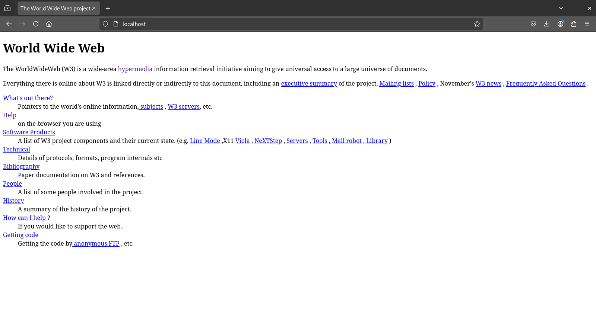
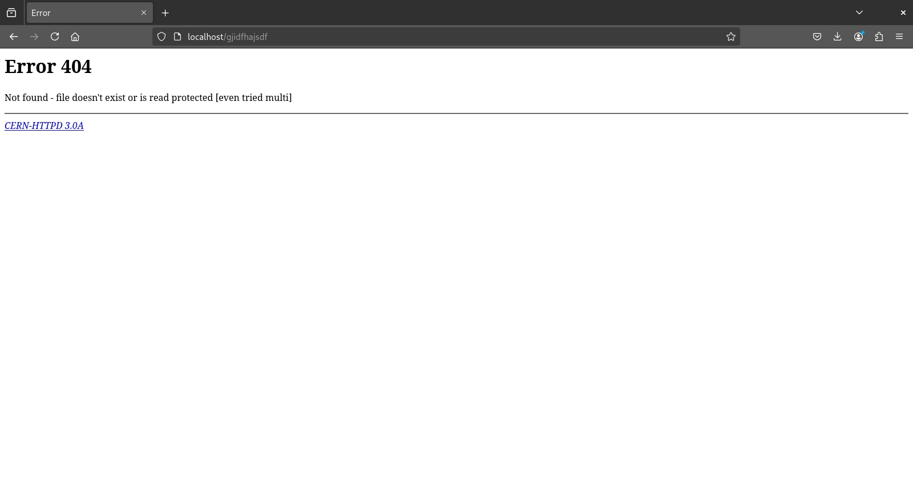

# cern-httpd


**Ever wondered what the first web server looked like running?**

**Ever wondered what the first web page looked like?**

This repository allows you to run the very first web server, created by web inventor Tim Berners-Lee, and **serve the first web page ever**, right from your computer!

This is made possible through Docker containerization and some **changes/retrofits I made to this old C code**, including:

- **Empty string check: from `SH` to `BASH`.**

    The script was written for `SH` and not for the later `BASH` shell. Modern shells like `BASH` support `==` within `[[ ... ]]` but not in `[ ... ]`. The modern `-z` operator is used to check if a string is empty.

- **Include any missing `<time.h>`.**

    Modern compilers and linkers often follow stricter rules for linking libraries and do not include additional libraries unless explicitly specified.

- **Custom types for variables related to Linux sockets.**

    Back then, everything used the `int` type! Today, things are more specialized, and there are custom types for variables related to Linux sockets, like `socklen_t`.

- **Remove `sys_errlist`.**

    In more recent systems and libraries, the `sys_errlist` buffer array has been replaced by `strerror` and `errno` buffer outputs.

- **Update Makefile.include for Linux to include `-lcrypt`.**

    Modern compilers and linkers often follow stricter rules for linking libraries and do not include additional libraries unless explicitly specified.

## Dependencies

- Docker
- Docker Compose
- Make

For Ubuntu, just run:
```
sudo snap install docker
sudo apt-get install make
```

## How to Run

```
sudo docker-compose up -d --build
```

or 

```
sudo make start
```

## How to Stop

```
sudo docker-compose down
```

or 

```
sudo make stop
```

## Easter Egg



Navigate to any page that doesn’t exist, such as `localhost/qwertyuiop`.

You’ll get a nice CERN 404 error page:

```
Error 404
Not found - file doesn't exist or is read protected [even tried multi]

CERN-HTTPD 3.0A
```

### Resources

- CERN HTTPd source code: [https://www.w3.org/Daemon/httpd/w3c-httpd-3.0A.tar.gz](https://www.w3.org/Daemon/httpd/w3c-httpd-3.0A.tar.gz)
- First web site source code: [https://www.w3.org/History/19921103-hypertext/hypertext/WWW/TheProject.html](https://www.w3.org/History/19921103-hypertext/hypertext/WWW/TheProject.html)